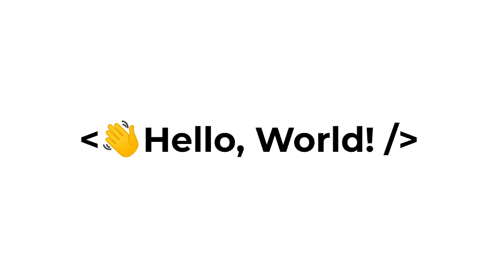

  

### I'm a Backend Developer 👩🏻‍💻

I'm passionate about building backend applications and learning how things work behind the scenes.

## Tech Stack

Backend  
C# • ASP.NET Core • .NET

Database  
SQL Server • Entity Framework Core

Architecture  
Clean Architecture • DDD • CQRS

Tools  : 
Git • GitHub • Docker • Visual Studio

  ## 🚀 Projects

### 🏨 Hotel Reservation System
A backend-focused hotel reservation system built with ASP.NET Core, Entity Framework Core, SQL Server, and Clean Architecture.

### 📚 Online Bookstore
An online bookstore built with ASP.NET Core MVC, Entity Framework Core, SQL Server, and ASP.NET Core Identity.
## 🌱 Currently Learning

- Domain-Driven Design (DDD)
- Clean Architecture
- CQRS & MediatR
- Docker
- Redis & Caching
- Software Design & Architecture
  ## 🤝 Connect With Me

- 📧 Email
